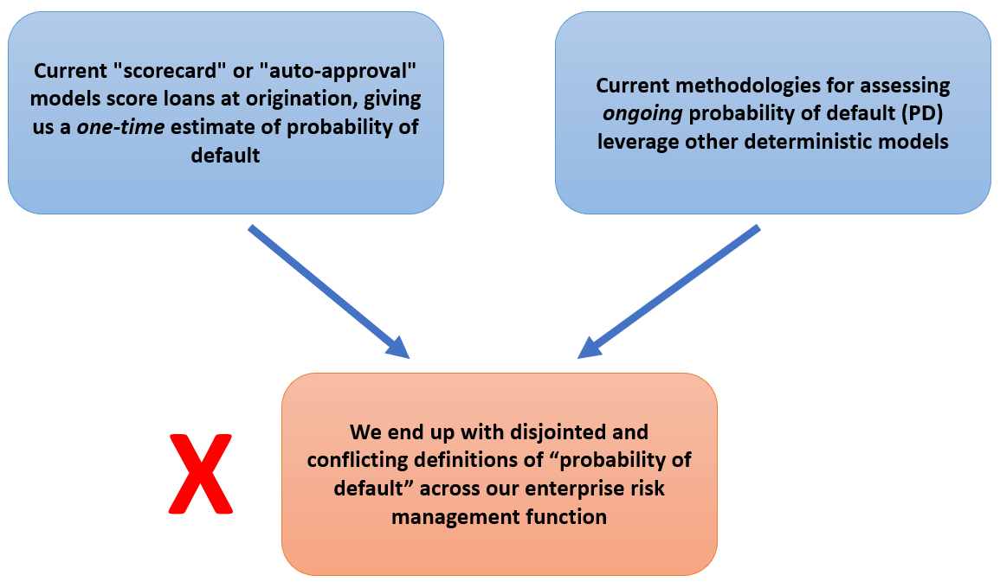
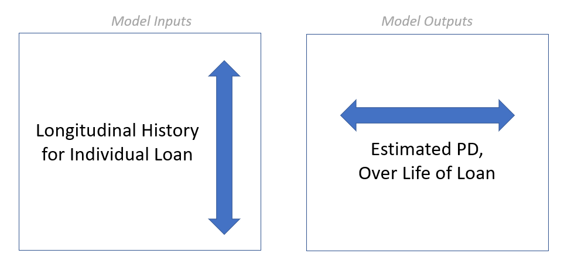

```{r setup, include=FALSE}
knitr::opts_chunk$set(echo = FALSE)
library(echarts4r)
source("build_plots.R")
```

Last week we discussed some high-level strategies for [getting more of your data into your model](https://blog.ketchbrookanalytics.com/posts/2022-02-19-making-small-data-bigger/). This week we are going to dive deeper into the benefits of credit risk modeling frameworks that go beyond the "traditional" (linear/logistic regression, decision trees, etc.) approaches. 

The central problem we are trying to solve today is multi-faceted:



To further complicate matters, regulatory requirements such as [CECL](https://www.occ.treas.gov/topics/supervision-and-examination/bank-operations/accounting/current-expected-credit-losses/index-current-expected-credit-losses.html) may lead to modeling probability of default in an entirely different way. 

## Making Risk More Dynamic

Let's envision a world where, instead of disparate models that assess probability of default at the time of certain credit events (e.g., origination, renewal, etc.), we have a *single* model that estimates PD in *real-time*.

This world is not just possible -- it's a framework that Ketchbrook Analytics has spent years developing, and building out for our banking clients.

### What Do We Have to Gain?

The value proposition for this framework includes **greater flexibility**, **decreased risk** and **improved insights**. The technical details of the modeling approach allow any organization to:

* incorporate new information (new repayment data, new economic outlook data, etc.) about a loan to *continuously* update it's predicted probability of default

* look at its portfolio on any given day and understand the current risk for a single loan, a segment of loans, or the entire portfolio

* simulate the impact of a new deal on the portfolio during the underwriting process

From a modeling perspective, this means that we want our inputs (predictors) to be the [longitudinal attributes](https://blog.ketchbrookanalytics.com/posts/2022-02-19-making-small-data-bigger#aggregation-is-limiting) about the loan, and the model output to be probability of default.



Even more specific, our model *output* should not be a single number -- it should instead be a *curve* that provides us with not just a predicted probability of default, but a probability of default *over the life of the loan*.

### A Basic Example

Take **Loan #1234**, for example. This five-year term loan just came into our bank today and passed through our model, which returned the following probability of default curve prediction:

```{r, fig.alt="Interactive Chart Showing Probability of Default over Time for a Single Loan"}
new_loan_plot
```

*[Tip: You can hover over the chart above -- it's interactive!]*

Our model estimates that **Loan #1234** has a 0.8% probability of defaulting sometime prior to the end of this year (2022), a 2.0% probability of defaulting between now and the end of 2023, ... , and a 16.0% probability of defaulting during its life.

Fast-forward two years later, and **Loan #1234** has not yet defaulted, with three years remaining on its five-year term. We have new information about this loan that we did not have at origination (e.g., repayment history), as well as updated information (e.g., industry outlook). Running it through our model again, the curve has likely changed:

```{r, fig.alt="Interactive Chart Showing Probability of Default over Time for a Single Loan, Two Years Later"}
existing_loan_plot
```

We would hope to see a loan with strong repayment history and an improving industry outlook to show less risk across the PD curve. Conversely, we would hope that a loan with multiple past due events and worsening industry outlook would have an updated PD curve that expressed greater risk (i.e., greater probability of default over the remaining life of the loan).

In the case of **Loan #1234**, it looks like it has performed pretty well, since the *updated* probability of defaulting before term is down from 16.0% to 7.2%.

### Application in Practice

If we want to know the probability of a specific loan (including a new loan, a renewal, or a group of existing loans in a portfolio) defaulting *today*, we can easily get this by looking at the left-most point on the PD curves above.

If we want to know the probability of a loan *ever* defaulting during its life, we can easily get this by looking at the right-most point on the curve.

> From a practical perspective, having a modeling framework that provides probability of default estimates at *any time* (including origination) that updates dynamically as we get new information allows us to quickly build automated loan decisioning, scorecard lending, CECL, and stress testing models.

## Interested in Learning More?

Get in touch with us today at [info@ketchbrookanalytics.com](mailto:info@ketchbrookanalytics.com)
