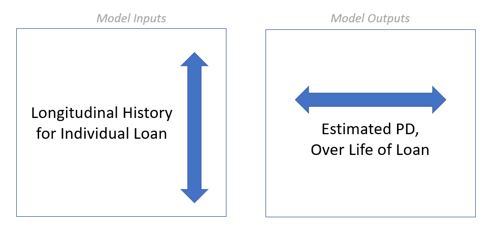

```{r setup, include=FALSE}
knitr::opts_chunk$set(echo = FALSE)
library(echarts4r)
source("build_plots.R")
```

In our last blog post, we discussed some high-level strategies for [getting more of your data into your model](https://blog.ketchbrookanalytics.com/posts/2022-02-19-making-small-data-bigger/). This week we are going to dive deeper into the benefits of credit risk modeling frameworks that go beyond the "traditional" (linear/logistic regression, decision trees, etc.) approaches.

## Making Risk More Dynamic

Let's envision a world where, instead of disparate models that assess probability of default at the time of certain credit events (i.e., one model for origination, another model for renewal, a third for [CECL](https://www.occ.treas.gov/topics/supervision-and-examination/bank-operations/accounting/current-expected-credit-losses/index-current-expected-credit-losses.html), etc.), we have a *single* model that estimates PD in *real-time*.

This world is not just possible -- it's a framework that Ketchbrook Analytics has spent years developing and building out for our banking clients.

The **value proposition** for this framework includes *greater flexibility*, *decreased risk* and *improved insights*. The **technical details** of the modeling approach allow any organization to:

* incorporate new information (new repayment data, new economic outlook data, etc.) about a loan to *continuously* update it's predicted probability of default

* look at its portfolio on any given day and understand the current risk for a single loan, a segment of loans, or the entire portfolio

* simulate the impact of a new deal on the portfolio during the underwriting process

From a modeling perspective, this means that we want our inputs (predictors) to be the [longitudinal attributes](https://blog.ketchbrookanalytics.com/posts/2022-02-19-making-small-data-bigger#aggregation-is-limiting) about the loan, and the model output to be probability of default.



With each additional on-time payment, we would expect our model to decrease the associated probability of default. Conversely, if new economic outlook data forecasts worsening industry conditions, the model should update the probability of default to show increasing risk.

## Taking a Forward-Looking Approach

Even more specifically, our model's output should not be a single number -- it should instead be a *curve* that provides us with not just a predicted probability of default, but a probability of default *over the life of the loan*.

Take **Loan #1234**, for example. This five-year term loan just came into our bank today and passed through our model, which returned the following probability of default curve prediction:

```{r, fig.alt="Interactive Chart Showing Probability of Default over Time for a Single Loan"}
new_loan_plot
```

*[Tip: You can hover over the chart above -- it's interactive! Each point represents the probability of the loan defaulting at or before that date. If we want to know the probability of a specific loan (including a new loan, a renewal, or a group of existing loans in a portfolio) defaulting today, we can easily get this by looking at the left-most point on the PD curve(s). If we want to know the probability of a loan ever defaulting during its life, we can easily get this by looking at the right-most point.]*

Our model estimates that **Loan #1234** has a 0.8% probability of defaulting sometime prior to the end of this year (2022), a 2.0% probability of defaulting between now and the end of 2023, and so on, with a 16.0% probability of defaulting during its life.

Fast-forward two years later, and **Loan #1234** has not yet defaulted, with three years remaining on its five-year term. We have new information about this loan's performance that we did not have at origination (e.g., repayment history), as well as updated information (e.g., industry outlook). Running it through our model again, the curve has likely changed:

```{r, fig.alt="Interactive Chart Showing Probability of Default over Time for a Single Loan, Two Years Later"}
existing_loan_plot
```

In the case of **Loan #1234**, it looks like it has been performing pretty well, since the *updated* probability of defaulting before term is down from 16.0% to 7.2%.

### One Model to Rule Them All

In our toy example, we used an annual frequency along the x-axis of our charts. In practice, this frequency would be much more granular -- at least monthly, and hopefully daily. Remember, the time granularity of our model's output is tied directly to the frequency of the input data. In other words, if we get new repayment & economic outlook data each *month*, then (1) our model will output a predicted probability of default for each *month* into the future, and (2) that prediction curve can be updated each *month*.

> From a practical perspective, having a modeling framework that provides probability of default estimates in **real-time** (including origination) that updates dynamically as we get new information allows us to quickly build automated loan decisioning, scorecard lending, CECL, and stress testing models along the **same** probability of default framework.

## Interested in Learning More?

Get in touch with us today at [info@ketchbrookanalytics.com](mailto:info@ketchbrookanalytics.com)
