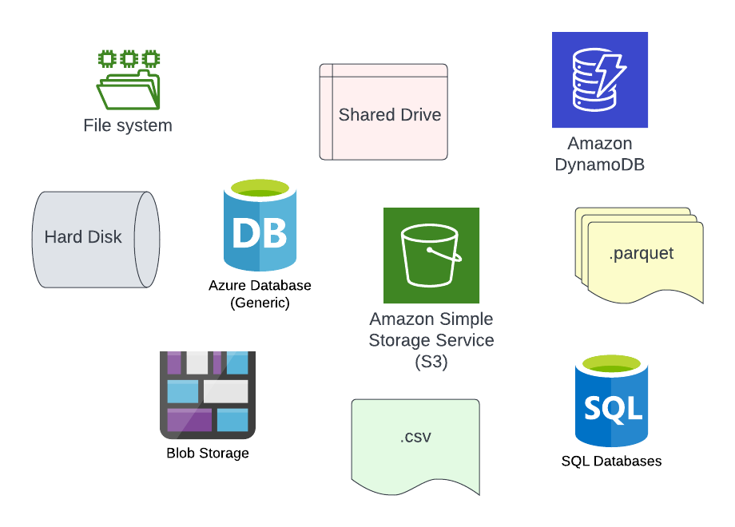
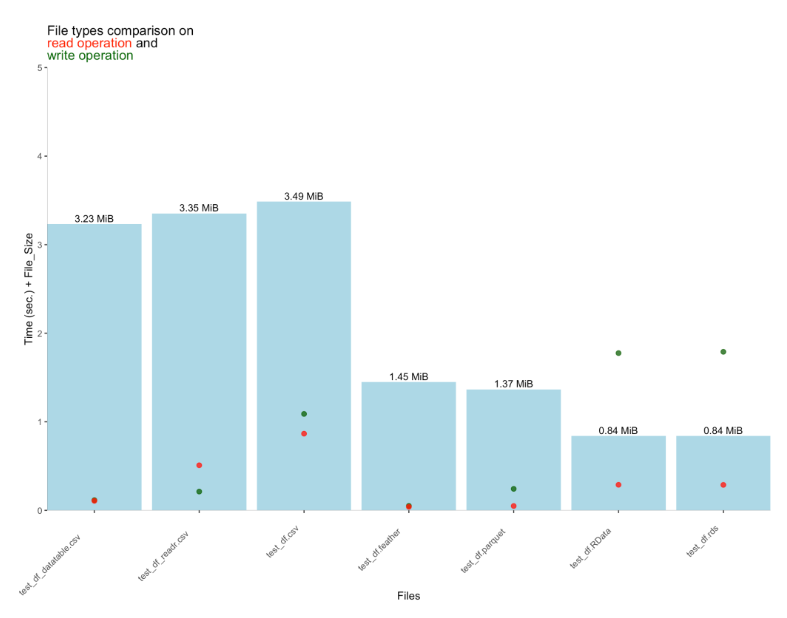

```{r setup, include=FALSE}
knitr::opts_chunk$set(echo = TRUE)

dir <- here::here("_posts/2022-06-02-shiny-and-arrow/data")
```

Shiny apps are incredible tools for bringing data science to life. They can help communicate your analysis to non-technical stakeholders, or enable self-service data exploration for any audience. At [Ketchbrook Analytics](https://www.ketchbrookanalytics.com), we care a lot about building  *production-grade* quality Shiny apps; in other words, we strive to ensure sure that the apps we develop for you will run successfully inside your organization with minimal maintenance. 

Building a working Shiny app that runs on your own laptop can be a tricky process itself! However, there are some additional things you need to consider when taking the next step of *deploying* your app to **production** so that others can reap the benefits of your hard work. One of these considerations is where to *store* the data.

> "Where should the data live? Should we use a database or flat file(s)? Is our data small enough to fit there?"



## Storing Your Data

There are *so* many options to choose from when it comes to how you want to store the data behind your Shiny app. Sometimes a traditional database doesn't make sense for your project. Databases can take a while to configure, and if your data isn't relational then a *data lake* approach might be a better option. A **data lake** is just a fancy term for a collection of flat files that are organized in a thoughtful way.

When you think about storing data in flat files, formats like **.csv** or **.txt** probably come to mind. However, as your data becomes *"big"*, transitioning your data to more modern, column-oriented file types (e.g., **.parquet**) can drastically reduce the size of the file containing your data and increase the speed at which other applications can read that data.

### The Benefits of .parquet

First, let's dig a little deeper into the advantages of **.parquet** over **.csv**. The main benefits are:

* smaller file sizes
* improved read speed

The compression and columnar storage format lead to file sizes that are significantly smaller than if that same data were stored in a typical delimited file. From our experience -- and also backed by [this great blog post by Tomaž Kaštrun](https://tomaztsql.wordpress.com/2022/05/08/comparing-performances-of-csv-to-rds-parquet-and-feather-data-types/) -- **.parquet** typically comes in at a little less than half the size of a data-equivalent **.csv**; however, this margin widens even further as the data volume increases. Included in Tomaž's article is this fantastic chart (below) illustrating the read, write, and file size metrics he gathered while experimenting across many different file types and sizes.



Interestingly, **.parquet** files not only store your data, but they also store *data about your data* (i.e., metadata). Information such as minimum & maximum values are stored for each column, which help make aggregation blazing fast.   
Still not sold? Maybe you are wondering, 

> Is ".parquet" a sustainable file format for storing my data, or is it just a fad?

That's a fair question! The last thing we want to do as data scientists is to create more technical debt for our organization. Rest assured, **.parquet** format is not going anywhere -- many production workflows at major organizations are driven by **.parquet** files in a data lake.

[Voltron Data](https://voltrondata.com/) is the company behind **.parquet** format and the greater [*Apache Arrow*](https://arrow.apache.org/) project. They recently finished their Series A round by [raising $110 Million in funding](https://voltrondata.com/news/fundinglaunch/) to continue to develop this technology. Needless to say, we won't be seeing **.parquet** format going away any time soon.

Lastly, unlike **.RDS** files, **.parquet** is a cross-platform file storage format, which means you can work with **.parquet** files from [just about any programming language](https://github.com/apache/arrow#powering-in-memory-analytics), including R. This is where the [{arrow}](https://github.com/apache/arrow/tree/master/r#arrow) package can help.

### The Benefits of {arrow}

The **{arrow}** package provides major benefits:

1. It has the ability to read & write **.parquet** files (among other file types)
2. You can query the data in that file *before* bringing it into an R data frame, using **{dplyr}** verbs, which provides for dramatic speed improvements

The combination of **{arrow}** and **{dplyr}** also results in *lazy evaluation* of your data manipulation statements. This means that your {dplyr} functions build a "recipe" of transformation steps that will only evaluate once you are finally ready to bring the transformed data into memory (through the use of `dplyr::collect()`). Don't take our word for it, though; hear it [straight from the Apache Arrow team](https://arrow.apache.org/docs/r/articles/dataset.html):

> "...[A]ll work is pushed down to the individual data files, and depending on the file format, chunks of data within the files. As a result, you can select a subset of data from a much larger dataset by collecting the smaller slices from each file -- you don’t have to load the whole dataset in memory to slice from it."

## How It All Fits Together in Shiny: A Use Case at Ketchbrook Analytics

We have learned that the combination of **{arrow}** + **{dplyr}** + **.parquet** gives us all of the memory-saving benefits we would get from querying a database, but with the simplicity of flat files.

Ketchbrook was developing a Shiny app for a client, for which the relevant data was stored in a large, single **.csv** that was causing two problems:

1. There wasn't enough room for the file on their **shinyapps.io** server
2. Even when run locally, applying filters and aggregations to the data from within the app was slow

After converting the large **.csv** file into **.parquet** format, the data become one-sixth of the size of the original **.csv** -- plenty of room available on the server for the **.parquet** data.

Further, executing `dplyr::filter()` on the already-in-memory **.csv** data was taking quite a few seconds for the app to respond. The conversion of the data to **.parquet** format, coupled with executing the **{dplyr}** functions against an **{arrow}** table (instead of an R data frame), drastically reduced the processing time to less than one second.

To demonstrate this powerful combination of **{shiny}** + **{arrow}**, Ketchbrook Analytics developed an [example Shiny app](https://ketchbrookanalytics.shinyapps.io/shiny_arrow/) and accompanying [GitHub repository](https://github.com/ketchbrookanalytics/shiny_arrow).

Play around with the app, dive into the code, and try incorporating **{arrow}** into your next Shiny project!

### The Proof is in the Pudding (and the File Size)

For our [example Shiny app](https://ketchbrookanalytics.shinyapps.io/shiny_arrow/), we created a mock dataset, and stored it in both **.txt** and **.parquet** format. You can create this data yourself by running [these two scripts](https://github.com/ketchbrookanalytics/shiny_arrow/tree/main/data-raw).

For comparison, let's view the size of the data that's stored in tab-delimited **.txt** file format:

```{r}
files <- fs::file_info(
  path = list.files(
    dir, 
    full.names = TRUE
  )
) |> 
  dplyr::select(path, size) |> 
  dplyr::mutate(
    path = fs::path_file(path), 
    file_type = stringr::str_extract(
      string = path, 
      pattern = "[^.]+$"   # extract text after period
    )
  )

files |> 
  dplyr::filter(file_type == "txt") |> 
  knitr::kable()
```

We can see that the **.txt** files total `r as.character(sum(files[files$file_type == "txt", ]$size))` in size.

Now let's look at the data when stored as **.parquet** file format:

```{r}
files |> 
  dplyr::filter(file_type == "parquet") |> 
  knitr::kable()
```

Wow! The same dataset is less than half the size when stored as **.parquet** as compared to **.txt**.

### The Need for Speed

We saw the storage savings in action -- now let's take a look at the speed improvements.

As a practical example, let's run a sequence of `dplyr::filter()`, `dplyr::group_by()`, and `dplyr::summarise()` statements against the **.txt** file:

```{r}
tic <- Sys.time()

vroom::vroom(
  list.files(
    path = dir, 
    full.names = TRUE, 
    pattern = ".txt$"
  ), 
  delim = "\t"
) |> 
  dplyr::filter(Variable_H > 50) |> 
  dplyr::group_by(Item_Code) |> 
  dplyr::summarise(
    Variable_A_Total = sum(Variable_A)
  )

toc <- Sys.time()

time_txt <- difftime(toc, tic)

time_txt
```

When run against the **.txt** file, the process takes `r as.numeric(time_txt)` seconds to run.

Now let's try the same **{dplyr}** query against the **.parquet** file:

```{r}
tic <- Sys.time()

arrow::open_dataset(
  sources = list.files(
    path = dir, 
    full.names = TRUE, 
    pattern = ".parquet$"
  ), 
  format = "parquet"
) |> 
  dplyr::filter(Variable_H > 50) |>
  dplyr::group_by(Item_Code) |>
  dplyr::summarise(
    Variable_A_Total = sum(Variable_A)
  ) |> 
  dplyr::collect()

toc <- Sys.time()

time_parquet <- difftime(toc, tic)

time_parquet
```

Wow! It might not seem like much, but the difference between a user having to wait `r round(as.numeric(time_txt), 2)` seconds for your Shiny app to execute a process versus having to wait `r round(as.numeric(time_parquet), 2)` seconds is incredibly significant from a *user experience* standpoint.

But don't just take our word for it. Make your next Shiny app an **{arrow}**-driven, high-performance experience for your own users!
